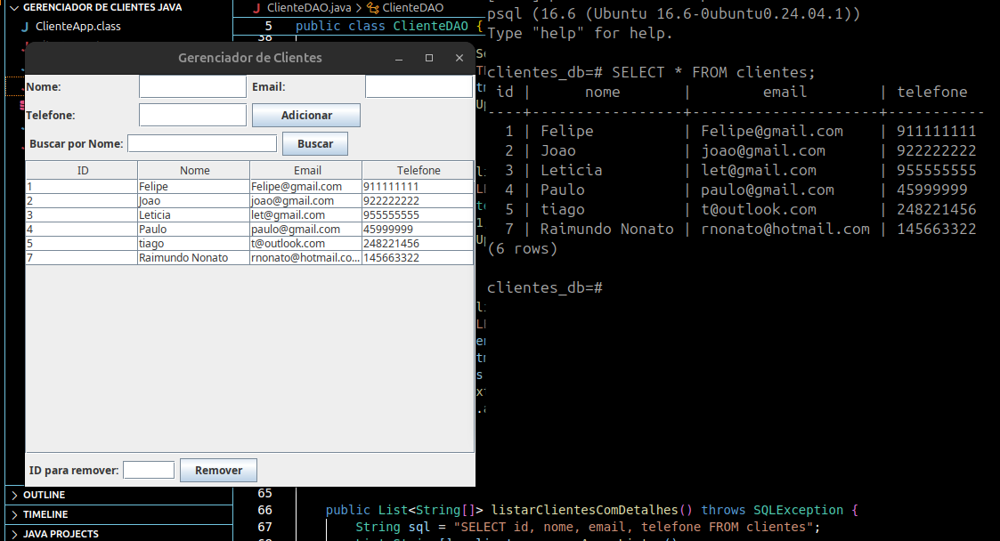

# Gerenciador de Clientes em Java

Sistema de gerenciamento de clientes desenvolvido em Java com interface gráfica (Swing). Ele permite adicionar, remover, listar e buscar clientes armazenados em um banco de dados PostgreSQL. A aplicação utiliza os padrões de projeto Singleton e DAO para garantir uma arquitetura limpa e modular, além de aproveitar a Framework Collections para manipulação de dados. Ideal para estudos e projetos de gerenciamento simples.

